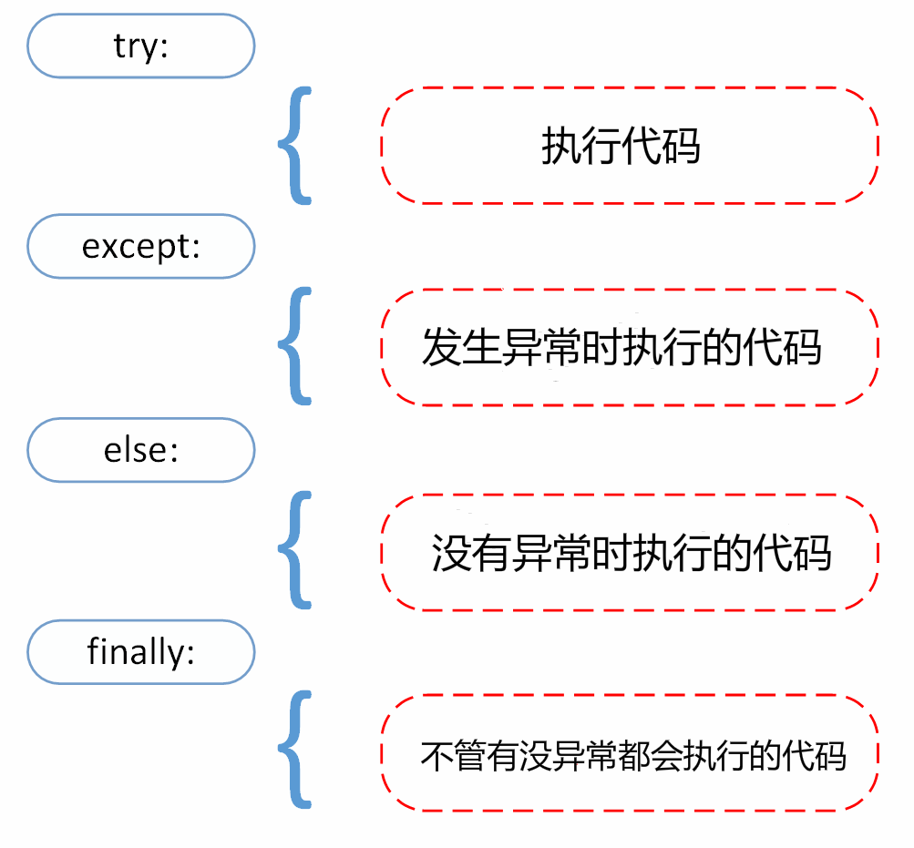

# 一个 Java 开发学习 Python 记录

> [Python3 教程 | 菜鸟教程](https://www.runoob.com/python3/python3-tutorial.html)

# 1. 注释

python 单行注释:`#`，多行注释:`"""""`
> python 的多行注释本质是未被引用的字符串

# 2. 字符串格式化输出 %、{}

```python
name = "小明"
age = 18
# 方法一
print("名字：%s，年龄：%d" % (name, age))
# 方法二 3.6 版本的解释器才有
print(f"名字：{name}，年龄：{age}")
```

字典的格式化输出

```python
table = {'Google': 1, 'Baidu': 2, 'Taobao': 3}
for name, number in table.items():
    print('{0:10} ==> {1:10d}'.format(name, number))
```

> `{0:10}` 表示的是第一个参数（在这个例子中是name）会被转换成一个字符串，并且至少占据10个字符宽度的空间。

```python
table = {'Google': 1, 'Baidu': 2, 'Taobao': 3}
print('Baidu: {0[Baidu]:d}; Google: {0[Google]:d}; Taobao: {0[Taobao]:d}'.format(table))
print('Baidu: {Baidu:d}; Google: {Google:d}; Taobao: {Taobao:d}'.format(**table))
```

> 这种方式利用了`**`运算符来解包字典`table`

# 3. python 中特殊的运算符和关键字

1. `//` 整除
2. `**` 幂运算
3. `not` 关键字 相当于 Java 中的 `!`
4. `a, b = 1, 2` 多变量赋值
5. `in` 可以检查成员关系
6. `:=` 赋值表达式 又叫 海象运算符，将赋值和应用并为一步
7. `[out_exp_res for out_exp in input_list if condition]` 推导式
8. `and` 和 `or` 相当于 Java 中的 `&&`和`||`

# 4. python 元组使用小括号 `()`，列表使用方括号 `[]`。

- 元组的元素不能修改
- 其他使用方法和列表基本一致

# 5. Python 装饰器

- Python 装饰器直接改变了函数的执行流程，可以在函数调用前后添加自定义逻辑。
- Java 注解则是在编译时或运行时提供元数据，需要通过反射 API 或其他工具来读取并处理注解信息。

```python
def repeat(n):
    def decorator(func):
        def wrapper(*args, **kwargs):
            result = None
            for _ in range(n):
                result = func(*args, **kwargs)
            return result

        return wrapper

    return decorator


@repeat(3)
def greet(name):
    print(f"Hello, {name}!")


greet("Alice")
```

除了函数装饰器，Python 还支持类装饰器。类装饰器是包含 __call__ 方法的类，它接受一个函数作为参数，并返回一个新的函数。

```python
class DecoratorsClass:
    def __init__(self, func):
        self.func = func

    def __call__(self, *args, **kwargs):
        print("Before calling the function")
        result = self.func(*args, **kwargs)
        print("After calling the function")
        return result


@DecoratorsClass
def my_function():
    print("Inside the function")


my_function()
```

# 5. Python 标准库

Python 3 的标准库非常丰富，提供了大量的模块来支持各种功能。以下是一些主要的模块和它们的用途：

1. **os**: 提供与操作系统交互的功能，如文件操作、进程管理等。
2. **sys**: 提供与 Python 解释器交互的功能，如命令行参数、解释器状态等。
3. **math**: 提供数学函数，如三角函数、对数函数等。
4. **cmath**: 复数数学函数。
5. **random**: 随机数生成。
6. **statistics**: 统计计算，如平均值、中位数、众数等。
7. **datetime**: 日期和时间处理。
8. **time**: 时间相关功能，如延时、时间格式化等。
9. **re**: 正则表达式支持。
10. **string**: 字符串操作函数和常量。
11. **collections**: 高级数据结构，如 defaultdict、deque 等。
12. **itertools**: 迭代器函数，用于高效循环。
13. **functools**: 函数工具，如偏函数、装饰器等。
14. **operator**: 实现内建操作符的函数。
15. **contextlib**: 上下文管理器，用于 with 语句。
16. **argparse**: 命令行参数解析。
17. **json**: JSON 数据编码和解码。
18. **pickle**: 对象序列化和反序列化。
19. **shutil**: 高级文件操作，如复制、移动文件和目录等。
20. **zipfile**: ZIP 文件存档读写。
21. **tarfile**: TAR 文件存档读写。
22. **gzip** 和 **bz2**: 压缩文件读写。
23. **socket**: 网络编程。
24. **http.server**: 简单的 HTTP 服务器。
25. **urllib**: URL 请求和解析。
26. **requests** (虽然不是标准库，但非常常用): HTTP 请求库。
27. **email**: 邮件处理。
28. **sqlite3**: SQLite 数据库接口。
29. **csv**: CSV 文件读写。
30. **xml.etree.ElementTree**: XML 文档解析和生成。
31. **subprocess**: 子进程管理。
32. **pathlib**: 路径操作，提供面向对象的 API。

# 6. 文件读写

`open(file, mode='r', buffering=-1, encoding=None, errors=None, newline=None, closefd=True, opener=None)
`

* file: 必需，文件路径（相对或者绝对路径）。
* mode: 可选，文件打开模式。默认是`r`
* buffering: 设置缓冲
* encoding: 一般使用utf8
* errors: 报错级别
* newline: 区分换行符
* closefd: 传入的file参数类型
* opener: 设置自定义开启器，开启器的返回值必须是一个打开的文件描述符。

例如：

```python
file = open("./0hello.py")
print(file.read())
file.close()

file_w = open("../other/test.txt", "w")
file_w.write("Java 是世界上最好的语言")
file_w.close()
```

## 6.1 不同的模式(mode)

| 模式  | 描述                                                                                |
|-----|-----------------------------------------------------------------------------------|
| r   | 以只读方式打开文件。文件的指针将会放在文件的开头。这是默认模式。                                                  |
| rb  | 以二进制格式打开一个文件用于只读。文件指针将会放在文件的开头。                                                   |
| r+  | 打开一个文件用于读写。文件指针将会放在文件的开头。                                                         |
| rb+ | 以二进制格式打开一个文件用于读写。文件指针将会放在文件的开头。                                                   |
| w   | 打开一个文件只用于写入。如果该文件已存在则打开文件，并从开头开始编辑，即原有内容会被删除。如果该文件不存在，创建新文件。                      |
| wb  | 以二进制格式打开一个文件只用于写入。如果该文件已存在则打开文件，并从开头开始编辑，即原有内容会被删除。如果该文件不存在，创建新文件。                |
| w+  | 打开一个文件用于读写。如果该文件已存在则打开文件，并从开头开始编辑，即原有内容会被删除。如果该文件不存在，创建新文件。                       |
| wb+ | 以二进制格式打开一个文件用于读写。如果该文件已存在则打开文件，并从开头开始编辑，即原有内容会被删除。如果该文件不存在，创建新文件。                 |
| a   | 打开一个文件用于追加。如果该文件已存在，文件指针将会放在文件的结尾。也就是说，新的内容将会被写入到已有内容之后。如果该文件不存在，创建新文件进行写入。       |
| ab  | 以二进制格式打开一个文件用于追加。如果该文件已存在，文件指针将会放在文件的结尾。也就是说，新的内容将会被写入到已有内容之后。如果该文件不存在，创建新文件进行写入。 |
| a+  | 打开一个文件用于读写。如果该文件已存在，文件指针将会放在文件的结尾。文件打开时会是追加模式。如果该文件不存在，创建新文件用于读写。                 |
| ab+ | 以二进制格式打开一个文件用于追加。如果该文件已存在，文件指针将会放在文件的结尾。如果该文件不存在，创建新文件用于读写。                       |

> `r`开头的模式主要用于只读操作。`w`开头的模式主要用于写入操作，且会清空文件内容。`a`
> 开头的模式主要用于追加操作，不会清空文件内容。`+`表示既可以读又可以写。`b`的表示二进制格式。

## 6.2 file 对象常用方法

以下是 file 对象的常用方法，使用 `open` 函数创建的文件对象：

| 序号 | 方法及描述                                                                                                                    |
|----|--------------------------------------------------------------------------------------------------------------------------|
| 1  | `file.close()`<br>关闭文件。关闭后文件不能再进行读写操作。                                                                                   |
| 2  | `file.flush()`<br>刷新文件内部缓冲，直接把内部缓冲区的数据立刻写入文件，而不是被动的等待输出缓冲区写入。                                                            |
| 3  | `file.fileno()`<br>返回一个整型的文件描述符（file descriptor FD 整型），可以用在如 `os` 模块的 `read` 方法等一些底层操作上。                                 |
| 4  | `file.isatty()`<br>如果文件连接到一个终端设备返回 `True`，否则返回 `False`。                                                                  |
| 6  | `file.read([size])`<br>从文件读取指定的字节数，如果未给定或为负则读取所有。                                                                        |
| 7  | `file.readline([size])`<br>读取整行，包括 `"\n"` 字符。                                                                            |
| 8  | `file.readlines([sizeint])`<br>读取所有行并返回列表，若给定 `sizeint>0`，返回总和大约为 `sizeint` 字节的行，实际读取值可能比 `sizeint` 较大，因为需要填充缓冲区。        |
| 9  | `file.seek(offset[, whence])`<br>移动文件读取指针到指定位置。中文算是三个字节，定位到字符的中间，可能会导致解码问题。                                              |
| 10 | `file.tell()`<br>返回文件当前位置。                                                                                               |
| 11 | `file.truncate([size])`<br>从文件的首行首字符开始截断，截断文件为 `size` 个字符，无 `size` 表示从当前位置截断；截断之后后面的所有字符被删除，其中 Windows 系统下的换行代表 2 个字符大小。 |
| 12 | `file.write(str)`<br>将字符串写入文件，返回的是写入的字符长度。                                                                               |
| 13 | `file.writelines(sequence)`<br>向文件写入一个序列字符串列表，如果需要换行则要自己加入每行的换行符。                                                        |

## 6.3 pickle 模块

> pickle 模块用于序列化和反序列化 Python 对象。

```python
import pickle

# 序列化
data = {"name": "James", "age": 18, "gender": "male"}
file_s = open("../other/data.pkl", "wb")
pickle.dump(data, file_s)
file_s.close()
# 反序列化
file_ss = open("../other/data.pkl", "rb")
data_s = pickle.load(file_ss)
print(data_s)  # {'name': 'James', 'age': 18, 'gender': 'male'}
```

# 7. OS 模块

这里是按照功能重新排序的 `os` 模块方法和描述的表格：

| 功能分类       | 序号 | 方法及描述                                                                                                                                               |
|------------|----|-----------------------------------------------------------------------------------------------------------------------------------------------------|
| 目录和路径操作    | 1  | `os.chdir(path)` 改变当前工作目录                                                                                                                           |
|            | 2  | `os.getcwdb()` 返回一个当前工作目录的Unicode对象                                                                                                                 |
|            | 3  | `os.getcwd()` 返回当前工作目录                                                                                                                              |
|            | 4  | `os.listdir(path)` 返回path指定的文件夹包含的文件或文件夹的名字的列表。                                                                                                     |
|            | 5  | `os.makedirs(path[, mode])` 递归文件夹创建函数。像mkdir(), 但创建的所有intermediate-level文件夹需要包含子文件夹。                                                                |
|            | 6  | `os.mkdir(path[, mode])` 以数字mode的mode创建一个名为path的文件夹.默认的 mode 是 0777 (八进制)。                                                                          |
|            | 7  | `os.rmdir(path)` 删除path指定的空目录，如果目录非空，则抛出一个OSError异常。                                                                                                |
|            | 8  | `os.removedirs(path)` 递归删除目录。                                                                                                                       |
|            | 9  | `os.rename(src, dst)` 重命名文件或目录，从 src 到 dst                                                                                                          |
|            | 10 | `os.renames(old, new)` 递归地对目录进行更名，也可以对文件进行更名。                                                                                                       |
|            | 11 | `os.walk(top[, topdown=True[, onerror=None[, followlinks=False]]])` 输出在文件夹中的文件名通过在树中游走，向上或者向下。                                                      |
| 文件和链接操作    | 12 | `os.open(file, flags[, mode])` 打开一个文件，并且设置需要的打开选项，mode参数是可选的                                                                                        |
|            | 13 | `os.read(fd, n)` 从文件描述符 fd 中读取最多 n 个字节，返回包含读取字节的字符串，文件描述符 fd对应文件已达到结尾, 返回一个空字符串。                                                                    |
|            | 14 | `os.write(fd, str)` 写入字符串到文件描述符 fd中. 返回实际写入的字符串长度                                                                                                   |
|            | 15 | `os.close(fd)` 关闭文件描述符 fd                                                                                                                           |
|            | 16 | `os.dup(fd)` 复制文件描述符 fd                                                                                                                             |
|            | 17 | `os.dup2(fd, fd2)` 将一个文件描述符 fd 复制到另一个 fd2                                                                                                           |
|            | 18 | `os.lseek(fd, pos, how)` 设置文件描述符 fd当前位置为pos, how方式修改: SEEK_SET 或者 0 设置从文件开始的计算的pos; SEEK_CUR或者 1 则从当前位置计算; os.SEEK_END或者2则从文件尾部开始. 在unix，Windows中有效 |
|            | 19 | `os.truncate(fd, length)` 裁剪文件描述符fd对应的文件, 所以它最大不能超过文件大小。                                                                                            |
|            | 20 | `os.remove(path)` 删除路径为path的文件。如果path 是一个文件夹，将抛出OSError; 查看下面的rmdir()删除一个 directory。                                                                |
|            | 21 | `os.unlink(path)` 删除文件路径                                                                                                                            |
|            | 22 | `os.symlink(src, dst)` 创建一个软链接                                                                                                                      |
|            | 23 | `os.link(src, dst)` 创建硬链接，名为参数 dst，指向参数 src                                                                                                         |
|            | 24 | `os.readlink(path)` 返回软链接所指向的文件                                                                                                                     |
| 文件属性和权限操作  | 25 | `os.access(path, mode)` 检验权限模式                                                                                                                      |
|            | 26 | `os.chmod(path, mode)` 更改权限                                                                                                                         |
|            | 27 | `os.chown(path, uid, gid)` 更改文件所有者                                                                                                                  |
|            | 28 | `os.lchown(path, uid, gid)` 更改文件所有者，类似 chown，但是不追踪链接。                                                                                               |
|            | 29 | `os.lchmod(path, mode)` 修改连接文件权限                                                                                                                    |
|            | 30 | `os.fchmod(fd, mode)` 改变一个文件的访问权限，该文件由参数fd指定，参数mode是Unix下的文件访问权限。                                                                                   |
|            | 31 | `os.fchown(fd, uid, gid)` 修改一个文件的所有权，这个函数修改一个文件的用户ID和用户组ID，该文件由文件描述符fd指定。                                                                           |
|            | 32 | `os.chflags(path, flags)` 设置路径的标记为数字标记。                                                                                                             |
|            | 33 | `os.lchflags(path, flags)` 设置路径的标记为数字标记，类似 chflags()，但是没有软链接                                                                                        |
|            | 34 | `os.stat(path)` 获取path指定的路径的信息，功能等同于C API中的stat()系统调用。                                                                                              |
|            | 35 | `os.lstat(path)` 像stat(),但是没有软链接                                                                                                                    |
|            | 36 | `os.fstat(fd)` 返回文件描述符fd的状态，像stat()。                                                                                                                |
|            | 37 | `os.fstatvfs(fd)` 返回包含文件描述符fd的文件的文件系统的信息，Python 3.3 相等于 statvfs()。                                                                                  |
|            | 38 | `os.statvfs(path)` 获取指定路径的文件系统统计信息                                                                                                                  |
|            | 39 | `os.pathconf(path, name)` 返回相关文件的系统配置信息。                                                                                                            |
|            | 40 | `os.fpathconf(fd, name)` 返回一个打开的文件的系统配置信息。name为检索的系统配置的值，它也许是一个定义系统值的字符串，这些名字在很多标准中指定（POSIX.1, Unix 95, Unix 98, 和其它）。                              |
|            | 41 | `os.stat_float_times([newvalue])` 决定stat_result是否以float对象显示时间戳                                                                                      |
| 文件系统和设备操作  | 42 | `os.major(device)` 从原始的设备号中提取设备major号码 (使用stat中的st_dev或者st_rdev field)。                                                                             |
|            | 43 | `os.minor(device)` 从原始的设备号中提取设备minor号码 (使用stat中的st_dev或者st_rdev field )。                                                                            |
|            | 44 | `os.makedev(major, minor)` 以major和minor设备号组成一个原始设备号                                                                                                 |
| 文件描述符和终端操作 | 45 | `os.openpty()` 打开一个新的伪终端对。返回 pty 和 tty的文件描述符。                                                                                                       |
|            | 46 | `os.tcgetpgrp(fd)` 返回与终端fd（一个由os.open()返回的打开的文件描述符）关联的进程组                                                                                           |
|            | 47 | `os.tcsetpgrp(fd, pg)` 设置与终端fd（一个由os.open()返回的打开的文件描述符）关联的进程组为pg。                                                                                   |
|            | 48 | `os.isatty(fd)` 如果文件描述符fd是打开的，同时与tty(-like)设备相连，则返回true, 否则False。                                                                                   |
|            | 49 | `os.ttyname(fd)` 返回一个字符串，它表示与文件描述符fd 关联的终端设备。如果fd 没有与终端设备关联，则引发一个异常。                                                                                |
| 进程和信号操作    | 50 | `os.chdir(path)` 改变当前工作目录                                                                                                                           |
|            | 51 | `os.chroot(path)` 改变当前进程的根目录                                                                                                                        |
| 临时文件和目录操作  | 52 | `os.tempnam([dir[, prefix]])` Python3 中已删除。返回唯一的路径名用于创建临时文件。                                                                                        |
|            | 53 | `os.tmpfile()` Python3 中已删除。返回一个打开的模式为(w+b)的文件对象 .这文件对象没有文件夹入口，没有文件描述符，将会自动删除。                                                                      |
|            | 54 | `os.tmpnam()` Python3 中已删除。为创建一个临时文件返回一个唯一的路径                                                                                                       |
| 其他         | 55 | `os.pipe()` 创建一个管道. 返回一对文件描述符(r, w) 分别为读和写                                                                                                          |
|            | 56 | `os.popen(command[, mode[, bufsize]])` 从一个 command 打开一个管道                                                                                           |
|            | 57 | `os.fdatasync(fd)` 强制将文件写入磁盘，该文件由文件描述符fd指定，但是不强制更新文件的状态信息。                                                                                          |
|            | 58 | `os.fsync(fd)` 强制将文件描述符为fd的文件写入硬盘。                                                                                                                  |
|            | 59 | `os.utime(path, times)` 返回指定的path文件的访问和修改的时间。                                                                                                       |
|            | 60 | `os.pardir()` 获取当前目录的父目录，以字符串形式显示目录名。                                                                                                               |
|            | 61 | `os.closerange(fd_low, fd_high)` 关闭所有文件描述符，从 fd_low (包含) 到 fd_high (不包含), 错误会忽略                                                                     |
|            | 62 | `os.fdopen(fd[, mode[, bufsize]])` 通过文件描述符 fd 创建一个文件对象，并返回这个文件对象                                                                                    |
|            | 63 | `os.replace()` 重命名文件或目录。                                                                                                                            |

# 8. 异常

## 8.1 异常捕获



```python
try:
    result = 10 / 0
except ZeroDivisionError as e:
    print("不能除以零！", e)
except ValueError:
    print("输入的不是一个有效的数字！")
else:
    print(f"结果是: {result}")
finally:
    print("这段代码总是会执行。")
```

> 异常处理 try、except、else 和 finally

## 8.2 抛出异常

```python
raise Exception('抛出一个异常～')
```

> Python 使用 raise 语句抛出一个指定的异常。

## 8.3 自定义异常

```python
class MyError(Exception):
    def __init__(self, value):
        self.value = value

    def __str__(self):
        return repr(self.value)


raise MyError("啦啦啦")
```

# 9. 面相对象

## 9.1 类的构建

```python
class MyClass:
    """一个简单的类实例"""
    i = 12345

    def fun(self):
        return f'hello world{self.i}'
```

# 9.2 `__init__(self)` 构造方法

```python
class Complex:
    def __init__(self, real_part, imag_part):
        self.r = real_part
        self.i = imag_part
```

# 9.3 继承，Python支持单继承和多继承

```python
class Parent:  # 定义父类
    def my_method(self):
        print('调用父类方法')


class Child(Parent):  # 定义子类
    def my_method(self):
        print('调用子类方法')
```

# 9.4 类的专有方法(魔术方法)

1. `__init__` : 构造函数，在生成对象时调用
2. `__del__` : 析构函数，释放对象时使用
3. `__repr__` : 打印，转换
4. `__setitem__` : 按照索引赋值
5. `__getitem__`: 按照索引获取值
6. `__len__`: 获得长度
7. `__cmp__`: 比较运算
8. `__call__`: 函数调用
9. `__add__`: 加运算
10. `__sub__`: 减运算
11. `__mul__`: 乘运算
12. `__truediv__`: 除运算
13. `__mod__`: 求余运算
14. `__pow__`: 乘方

# 10. 命名空间和作用域

## 10.1 命名空间(namespace)

> A namespace is a mapping from names to objects.Most namespaces are currently implemented as Python dictionaries。<br/>
> 命名空间是从名称到对象的映射，大部分的命名空间都是通过 Python 字典来实现的。

在Python中，有四种主要的命名空间：

1. **内置命名空间（Built-in Namespace）**：
    - 包含Python内置的函数和异常等，例如`print()`、`len()`等。
    - 在解释器启动时创建，Python终止时销毁。

2. **全局命名空间（Global Namespace）**：
    - 包含在模块（脚本）中定义的变量和函数。
    - 在模块被导入时创建，解释器终止时销毁。

3. **模块命名空间（Module Namespace）**：
    - 每个模块都有自己的命名空间，包含模块中定义的所有全局变量、函数和类。
    - 在模块加载时创建。

4. **局部命名空间（Local Namespace）**：
    - 包含在函数或方法中定义的变量和参数。
    - 在函数调用时创建，函数返回后销毁。

```python
# var1 是全局名称
var1 = 5


def some_func():
    # var2 是局部名称
    var2 = 6

    def some_inner_func():
        # var3 是内嵌的局部名称
        var3 = 7
```

## 10.2 作用域(scope)

> A scope is a textual region of a Python program where a namespace is directly accessible. "Directly accessible" here
> means that an unqualified reference to a name attempts to find the name in the namespace.<br/>
> 作用域是 Python 程序中的一个文本区域，在这个区域内，一个命名空间是直接可访问的。“直接可访问”在这里的意思是，对一个名字的非限定引用会尝试在该命名空间中找到这个名字。

当Python解释器遇到一个变量时，它会按照以下顺序查找变量的值：

1. **L（Local）**：查找局部命名空间。
2. **E（Enclosing）**：查找嵌套函数的命名空间。
3. **G（Global）**：查找全局命名空间。
4. **B（Built-in）**：查找内置命名空间。

```python
x = 'global x'


def outer():
    x = 'outer x'

    def inner():
        x = 'inner x'
        print(x)  # inner x

    inner()
    print(x)  # outer x


outer()
print(x)  # global x
```

## 10.3 `global` 和 `nonlocal`

- **`global`关键字**：用于在函数内部声明一个全局变量，从而可以在函数内修改全局变量的值。
- **`nonlocal`关键字**：用于在嵌套函数中声明一个非局部变量，从而可以在内层函数中修改外层函数中的变量。

```python
x = 10  # 全局变量


def modify_global():
    global x  # 声明x是全局变量
    x = 20  # 修改全局变量x的值


modify_global()
print(x)  # 输出 20
```

```python
def outer():
    x = 10  # 外层函数的局部变量

    def inner():
        nonlocal x  # 声明x是外层函数的变量
        x = 20  # 修改外层函数的局部变量x的值

    inner()
    print(x)  # 输出 20


outer()
```